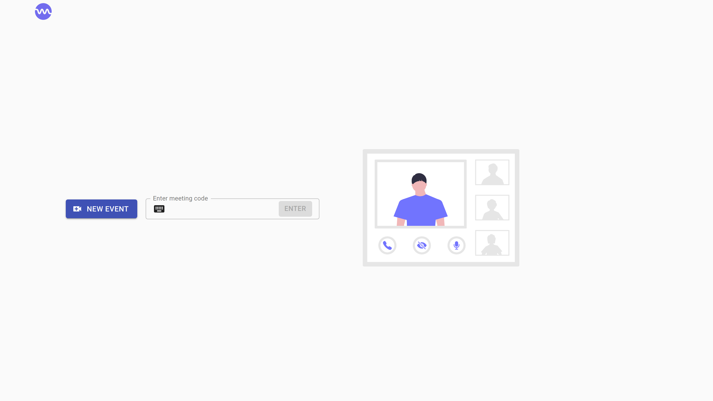

# Streamly

Streamly is an app to video conference powered by WebRTC.

## Acknowledgements

 - [Typescript](https://www.typescriptlang.org/docs/)
 - [NX](https://nx.dev/latest/react/getting-started/intro)
 - [Nest](https://docs.nestjs.com/)
 - [React](https://reactjs.org/docs/getting-started.html)
 - [React MUI](https://material-ui.com/getting-started/installation/)
 - [WebRTC](https://webrtc.org/getting-started/overview)
  
## Screenshots



---


 
## Run Locally

Clone the project

```bash
  git clone https://github.com/sebastiaomfneto/streamly
```

Go to the project directory

```bash
  cd streamly
```

Install dependencies

```bash
  npm install
```

Start the server

```bash
  npm run start
```

## License

[MIT](https://choosealicense.com/licenses/mit/)
  
